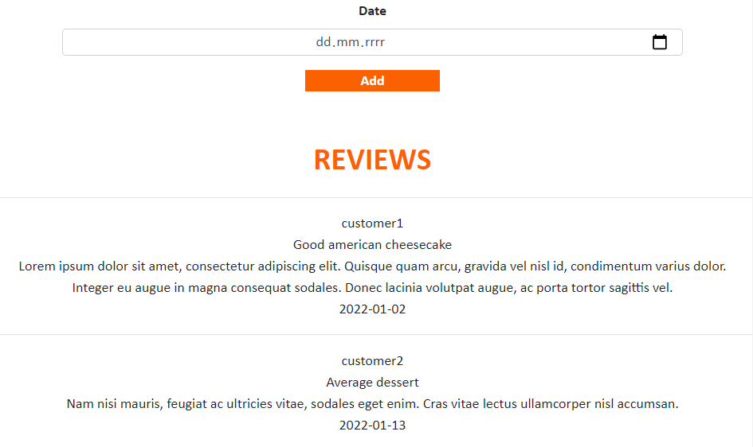
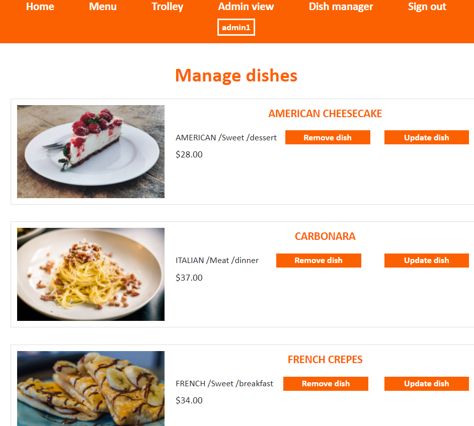

# Restaurant
### Restaurant website created for Intruduction to Web Applications course (WDAI) at AGH 2021/22
 

### Technology used:
* Angular
* Typescript
* HTML
* SCSS
* Firebase
  

### Home page
Restaurant is a website created to order dishes. 
 

 

### Menu 
As unlogged user you can browse the menu, use custom filters, change currency in which the prices are displayed and change number of dishes on the website.
 

 

### Sign in/ Sign up
To access other options you need to sign in. Thanks to AuthGuards you can't access other components without signing in.

There are 3 different types of accounts:
* customer  
* manager
* admin

 
You can create new customer account or sign in using 
this data:

| **login**           | **password**        | **user**      |
| :-----------------: | :-----------------: | :-----------: |
|   admin1@gmail.com  | admin1@gmail.com    | admin         |
| manager1@gmail.com  | manager1@gmail.com  | manager       |
| customer1@gmail.com | customer1@gmail.com | customer      |

 

 

### Dish details
As logged user you can click on the dish image to see more details. In dish details view you can see dish description, rate and reviews.
If you add dish to trolley you can add (only one) dish rate or review. Manager is not allowed to add rates or reviews.
 

 

### Trolley
After signing in you can add dishes to trolley.
In trolley you can see your whole order or change number of added dishes.
 

 

### Admin view
Only admin has access to admin view. He can add/delete roles (admin, manager, customer) or ban/unban other users.
 

 

### Dish manager
Admin and manager have access to dish manager. There they can change menu - update, remove or add dishes.

